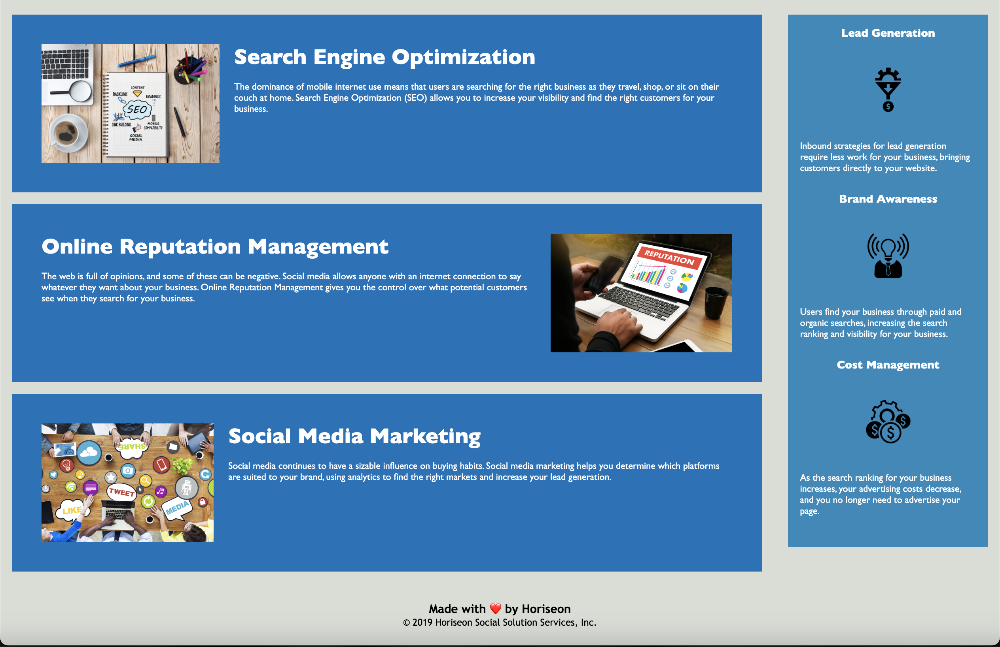

# 01_weekly-challenge

## Description
This repository host the first week challenge. This challenge aims to create an accessible webpage, provide structure to HTML elements, and identify semantic meaning in HTML elements.
## Installation
N/A

## Usage
To explore the final version of the web site please visit the following URL:
 https://carlos-2mm.github.io/horiseon-online-specialist/

A preview of the web site:

## Credits

https://github.com/coding-boot-camp/urban-octo-telegram
 This is the first repository.

https://www.w3schools.com/html/html5_semantic_elements.asp 
The content on this website helped in understanding the importance of structuring HTML elements properly and provided best practices to follow.

## License

Please refer to the LICENSE in the repo.